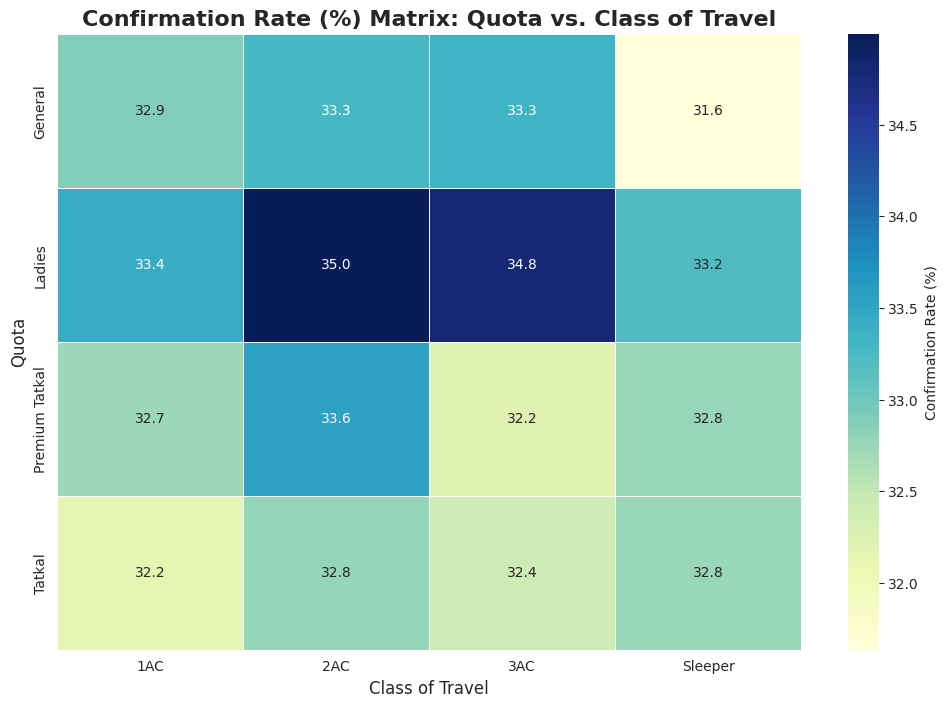

# Analysis of Indian Railways Ticket Confirmation 🚂

   

---

### Project Overview

This project is the capstone for the **Google Data Analytics Professional Certificate**. The objective is to analyze a synthetic dataset of Indian Railway ticket bookings to identify key factors that influence the confirmation of waitlisted tickets. The goal is to provide actionable insights for travelers to help them make smarter booking decisions.

---

### Key Insights & Visualizations

#### **1. The Quota & Class Interaction Matrix**
> The combination of travel class and ticket quota is the most powerful predictor of confirmation. The 'Ladies' quota in 1AC has the highest confirmation rate, while the 'Tatkal' quota in Sleeper has the lowest.

#### **2. The Group Size Effect Across Classes**
> The negative impact of traveling in a group is most severe in premium classes. For groups of 4 or more, it is statistically better to book in 3AC or Sleeper class.

---

### Actionable Recommendations

| For... | Recommendation | Rationale |
| :--- | :--- | :--- |
| **Solo Travelers** | Opt for the 'Ladies' quota in 1AC if applicable. | Highest probability of confirmation (37.6%). |
| **Large Groups (4+)** | Book in 3AC or Sleeper class. | Avoids the steep drop in confirmation rates seen in premium classes for groups. |
| **All Travelers** | Book on a weekday (especially Friday). | Provides a slight statistical edge over booking on a weekend. |

---

### Project Limitations

- **Synthetic Data:** The dataset is synthetically generated, which means some variables lack real-world randomness.
- **Constant Booking Window:** All bookings were made exactly 244 days before the journey, removing a key analytical dimension.

---

### How to Use This Repository

1.  Clone the repository: `git clone [your-repo-link]`
2.  The full analysis can be found in the `notebooks/eda.ipynb` file.
3.  A summary of the findings is available in the `presentation/` folder.